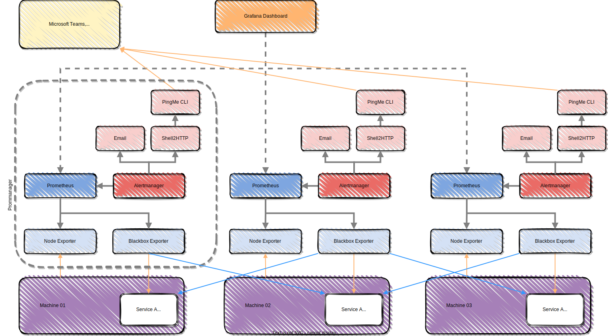

<!-- markdownlint-disable MD033 -->
<!-- markdownlint-disable-next-line -->
<h2 align="center">
  <br>
  <p align="center"></p>
PromManager for Prometheus
</h2>

<p align="center">
   <a href="https://github.com/matbgn/prommanager/releases">
   
   <a href="https://github.com/matbgn/prommanager/issues">
   
   <a href="https://github.com/matbgn/prommanager/blob/master/LICENSE.md">
   
</p>

<p align="center">
    
    
</p>

<p align="center">
  <a href="#supported-services">Supported Services</a> •
  <a href="#installation">Installation</a> •
  <a href="#usage">Usage</a> •
  <a href="#configuration">Configuration</a> •
  <a href="#miscellaneous">Miscellaneous</a> •
  <a href="#acknowledgments">Acknowledgments</a>
</p>

---


## Description
**PromManager** is a [KISS](https://en.wikipedia.org/wiki/KISS_principle) tool to set up, automatically update and execute Prometheus and related services with CLI on Linux servers which could be then interfaced with a Grafana Dashboard.

The main advantage is to facilitate maintenance trough multiple servers.

PromManager does not claim to allow all possible configurations with prometheus' ecosystem, but remains a good starting point for a simple and quick deployment.

## Out-of-the-Box integrated applications

- *Prometheus*
- *Node Exporter*
- *Blackbox Exporter*
- *Alertmanager*
- *Communication services such as:*
  - *Emails*
  - *Microsoft Teams*
  - *Telegram*
  - *SMS*
  - *And many more thanks to [PingMe CLI](https://pingme.lmno.pk/#/?id=supported-services) Integration*

## Installation
For latest stable version use following command:

    curl -s https://api.github.com/repos/matbgn/prommanager/releases/latest | awk -F \" -v RS="," '/browser_download_url/ {print $(NF-1)}' | xargs curl -OL
    chmod +x prommanager
    ./prommanager -h

For nightly deployment use:

    curl -OL https://raw.githubusercontent.com/matbgn/prommanager/master/prommanager
    chmod +x prommanager
    ./prommanager -h

### Installation via Ansible Galaxy
Be sure to have Ansible-core version 2.13+

```
ansible-galaxy install git+https://github.com/matbgn/prommanager
```

To update your galaxy role run the following command
```
ansible-galaxy install git+https://github.com/matbgn/prommanager --force

```

Considering the target hostname as `own-vmh-16` in your inventory, then:

1. Create a specific host_vars for this host beside you playbook.yml `host_vars > own-vmh-16.yml`, then give the following variables:
```
---
prommanager_version: v5.0.0                               # Which Prommanager version to install
prommanager_channel: nightly                              # Which Prommanager channel to use [stable/nightly]
prommanager_env_file: env/.env.prommanager.own-vmh-16     # Where is the Prommanager .env file locally located (will be push on host)
```

2. Based on the .env.example below populate yours

3. Then you can use it in your playbooks. For instance, for specific task use it this way:
```
---
- name: Install Prommanager
  tags:
    - install_prommanager
    - update_prommanager
  ansible.builtin.import_role:
    name: prommanager/roles/update_prommanager
```

Available tags are:
```
- install_prommanager
- update_prommanager
- update_prommanager_configuration
- update_prommanager_services
- prommanager_status
```

## Configuration

### Quick start

Prommanager requires a very minimal configuration to work, but aditionnal ones gives flexibility and comfort (see below)

All the communications services have corresponding environment variables associated with it. You
have to provide those within the .env file. See the [PingMe CLI Documentation Page](https://pingme.lmno.pk/#/services) for more details.

Prefer an installation in `/opt/prommanager/` as it is a good practice. If you want you can override this location via `ENV_FILE_PATH` variable (see below).

To activate configuration start by moving the provided .env.example as .env next to prommanager executable and edit it as needed :

```bash
# [MANDATORY] Configure email alert via smtp server
# ALERT_EMAIL_TO="test@example.com,toto@example.com"
ALERT_EMAIL_TO=""
# ALERT_EMAIL_SMTP_FROM="smtp_allowed_sender@example.com"
ALERT_EMAIL_SMTP_FROM=""
# ALERT_EMAIL_SMTP_HOSTNAME_AND_PORT="smtp.gmail.com:587"
ALERT_EMAIL_SMTP_HOSTNAME_AND_PORT=""
# ALERT_EMAIL_SMTP_USER="username" // in some cases it's the same as ALERT_EMAIL_SMTP_FROM
ALERT_EMAIL_SMTP_USER=""
# ALERT_EMAIL_SMTP_PASS="my_top_secret_pass"
ALERT_EMAIL_SMTP_PASS=""

# [RECOMMENDED] Set the .env & .versions file path location
ENV_FILE_PATH="/opt/prommanager/"

# [OPTIONAL] Add supplementary services to be notified from (space separated!)
# (see https://pingme.lmno.pk/ - except Email and Zulip NOT SUPPORTED HERE because provided by default, see above)
# e.g. NOTIFY_SERVICES='teams telegram slack'
NOTIFY_SERVICES=''
# Add also the corresponding **connection variables** like TELEGRAM_TOKEN, TELEGRAM_CHANNELS, SLACK_TOKEN, SLACK_CHANNELS, and so on corresponding to https://pingme.lmno.pk/#/services
# TEAMS_WEBHOOK=
# TELEGRAM_TOKEN=
# TELEGRAM_CHANNELS=
# etc...
```

Then simply install all services with the following command:
```bash
sudo ./prommanager --install --all
```

### Advanced configuration

```bash
# [OPTIONAL] Set linux architecture will be overridden by CLI flag e.g. --arch arm64
SYSTEM_ARCH=amd64

# [OPTIONAL] Set custom ports for services otherwise the port range from 9500-9600 will be used
NODE_EXPORTER_PORT=9500
BLACKBOX_EXPORTER_PORT=9510
ALERTMANAGER_PORT=9550
SHELL2HTTP_PORT=9560
PROMETHEUS_PORT=9590

# Add URLs to be watched (sensitive services for instance):
# [OPTIONAL] BLACKBOX_URL_TO_PROBE="http://localhost:9500/metrics, http://localhost:9560/, https://dashboard.example.com, https://productA.example.com, https://productB.example.com"
BLACKBOX_URL_TO_PROBE="http://localhost:9500/metrics, http://localhost:9560/,"

# [OPTIONAL] Set another repeat interval for firing new alerts with alertmanager
ALERTMANAGER_REPEAT_INTERVAL=4h
# [OPTIONAL] Set another Temperature threshold alarm [°C]
ALERTMANAGER_TEMPERATURE_THRESHOLD=77
# [OPTIONAL] Set another CPU threshold alarm [%]
ALERTMANAGER_CPU_THRESHOLD=80
```

### Tweaking alert rules

To edit more finely the rules fired by alertmanager, after installation, edit the file `/etc/prometheus/alert.rules.yml`. 

<table border="0">
  <tr>
    <td>:bulb:</td>
    <td>An awesome source of inspiration is https://awesome-prometheus-alerts.grep.to/</td>
  </tr>
</table>


## Usage
<table border="0">
  <tr>
    <td>:warning:</td>
    <td>Pay attention that this script needs root access for almost all its operations</td>
  </tr>
</table>

Get helper by running this command:

    sudo ./prommanager --help

### OS Architecture
Specify which one you want with (default is amd64):

    sudo ./prommanager --arch arm64 [--<flags>]

### Pull latest services versions
Get info with:

    sudo ./prommanager --versions --all

Then let the retrieved versions stored in .env file do the job for all:

    sudo ./prommanager --install --node --prometheus

Equivalent to:

    sudo ./prommanager --install --all

Or specify which version you will install by:

    sudo ./prommanager --install -N 1.1.2 -P 2.2.7

### Get actual services status

    sudo ./prommanager --status --all


## Architecture design

The architecture's design is mainly based on the advices of this book [Bastos, Joel and Araujo, Pedro. (2019) __Hands-On Infrastructure Monitoring with Prometheus: Implement and scale queries, dashboards, and alerting across machines and containers__. Birmingham, UK: Packt Publishing.](https://www.amazon.de/-/en/dp/1789612349?ie=UTF8&n=530484031) and is intended as following:



## Miscellaneous

- [Update OpenSSL and Curl on old systems](update_ssl_curl_on_old_systems.md)

## Acknowledgments

This project is based on those amazing projects:
- [Prometheus](https://github.com/prometheus/) (Apache License 2.0)
- [shdotenv](https://github.com/ko1nksm/shdotenv) (MIT License)
- [shell2http](https://github.com/msoap/shell2http) (MIT License)
- [PingMe CLI](https://github.com/kha7iq/pingme) (MIT License)

